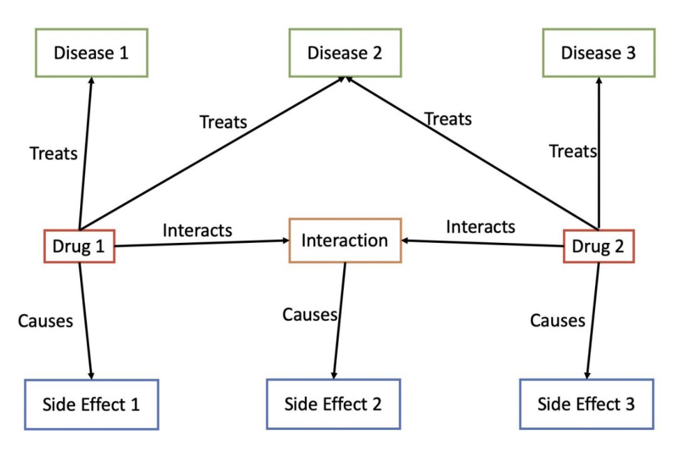

# Final Project for DS4300: Large Scale Information Storage & Retrieval

Final project for DS4300 (Large Scale Information Storage & Retrieval) taken at
Northeastern University

## Authors:

- Maris McGuinness: <https://github.com/marismcguinness>
- Genevieve Jawor: <https://github.com/gjawor>
- Bryce Russell-Benoit: <https://github.com/BryceCubes>
- Deepak Ramesh Sethuraman: <https://github.com/deepakramesh14>
- Benjamin Kosiborod (myself): <https://github.com/bendavp>

## Summary:

As part of the final project for Large-scale Information Storage and Retrieval,
we were tasked with applying our newfound skills using NoSQL databases to create
an interesting and useful application. Given some of our group members'
background in biology, we knew we wanted to create something at the intersection
of medicine and data science. We started with Stanford Biomedical Network data,
and decided to focus on associations between drugs, the diseases that they
treat, and the side effects that they cause. We created a graph-based
drug-disease-side effect association database in Neo4J, with the below
structure:

To learn more about the project, please see the presentation slides or the final
report in the root of this repo.

## Contents:

- the setup scripts (produces CSVs in a `data/` directory, see `setup/` folder
  for specific instructions)
- some example Cypher queries (`queries.cypher`)
- powerpoint, summarizing key points of project goals and outcomes
- a website (see `website/` folder for specific instructions)
